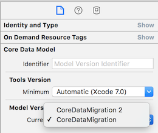

# The test:

1. Download this project to OS X 10.11.1 machine
2. Run the sample project.
3. Push the button labeled "Button" a few times.
4. Quit the app.
5. Select `CoreDataMigration.xcdatamodeld`
6. Change the model version to `CoreDataMigration 2`

7. Run the app again.

### Expected Result:
The app should launch

### Result I'm seeing:
Migration failure

-BJ